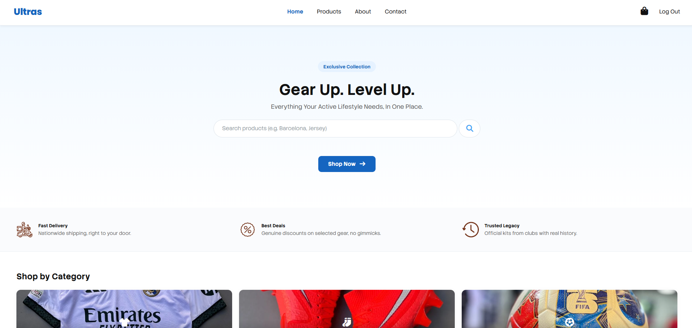
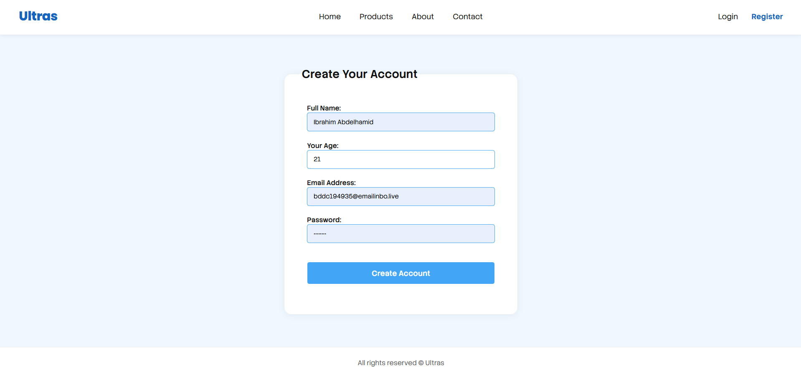
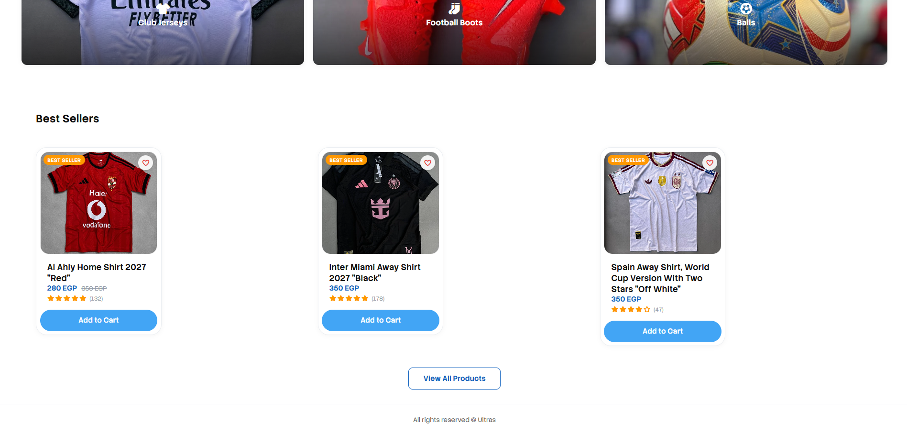
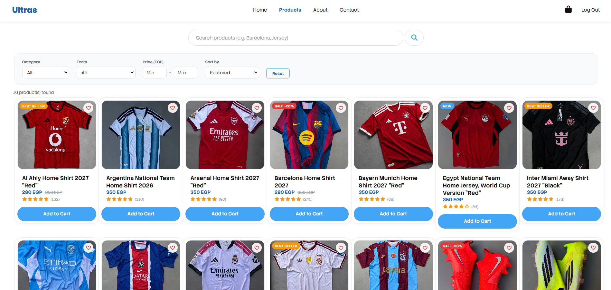
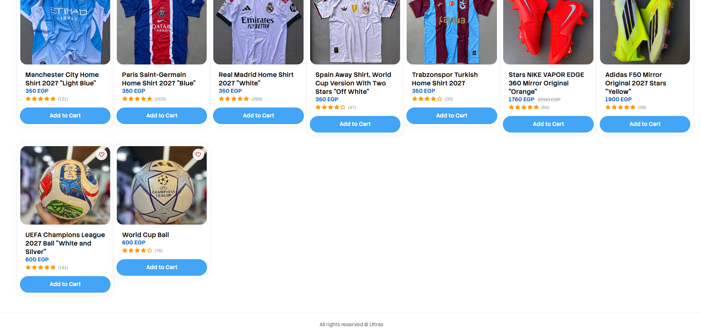
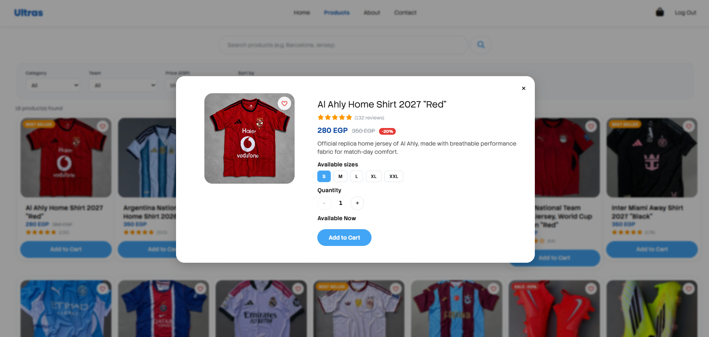
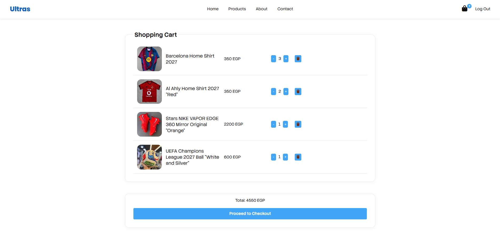
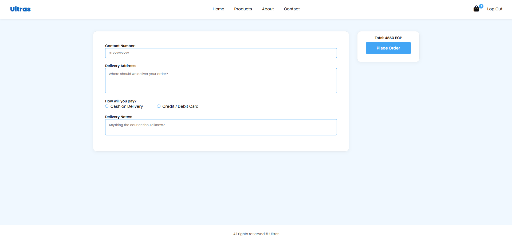

# Ultras — Football Gear E-Commerce App

A modern e-commerce platform for football gear — jerseys, boots, and balls — built with the MEAN stack.

## Tech Stack

**Backend**
- Node.js + Express 5
- MongoDB with Mongoose
- JWT authentication (`jsonwebtoken`)
- Password hashing with `bcrypt`
- Email confirmation via `nodemailer`

**Frontend**
- Angular (standalone components, signals)
- Server-Side Rendering (Angular SSR + Express)
- RxJS

## Screenshots

### Home Page
Welcoming users with a hero banner and product search.



### Secure User Registration
New users can create an account with full name, age, email, and password.



### Shop by Category & Best Sellers
Curated categories and best-selling jerseys, boots, and balls.



### Powerful Product Filtering
Filter products by category, team, and price, or sort results.



### Full Product Catalog
16 products spanning jerseys, football boots, and balls, each with ratings and pricing.



### Interactive Product Details
A quick-view modal shows sizes, quantity selection, and availability before adding to cart.



### Real-Time Shopping Cart
The cart tracks item quantities and totals live, ready for checkout.



### Streamlined Checkout
A simple checkout flow collects delivery details and payment method before placing the order.



## Project Structure

```
Full-Stack/
├── backend/
│   ├── db/
│   │   ├── models/        # Mongoose models (cart, order, product, user)
│   │   ├── dbConnection.js
│   │   └── seed.js        # Database seeding script
│   ├── src/
│   │   ├── middleware/     # Email check, mail confirmation, token verification
│   │   ├── modules/        # Feature modules
│   │   │   ├── cart/
│   │   │   ├── checkout/
│   │   │   ├── product/
│   │   │   └── user/
│   │   └── utilities/      # Email templates
│   └── index.js            # App entry point
├── frontend/
│   ├── src/                # Angular application source
│   └── angular.json
└── screenshots/            # App screenshots used in this README
```

## Getting Started

### Prerequisites
- Node.js
- MongoDB instance (local or cloud)

### Backend Setup

```bash
cd backend
npm install
npm run dev      # starts the server with --watch
```

Available scripts:
- `npm start` – run the server
- `npm run dev` – run the server with file watching
- `npm run seed` – seed the database

### Frontend Setup

```bash
cd frontend
npm install
npm start         # runs `ng serve`
```

Available scripts:
- `npm start` – run the Angular dev server
- `npm run build` – build for production
- `npm run watch` – build in watch mode (development)
- `npm run test` – run unit tests

## Features

- User authentication with JWT and email confirmation
- Dynamic product catalog with category, team & price filtering
- Product details view with size & quantity selection
- Shopping cart with real-time totals
- Multi-step checkout with delivery details & payment options
- Responsive, SSR-powered Angular frontend

## License

ISC
